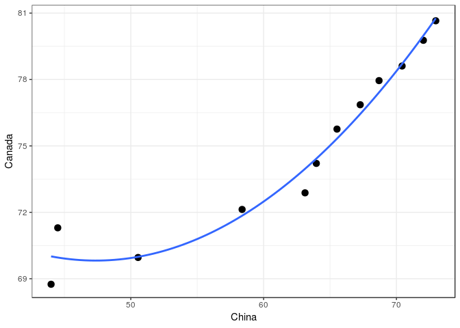

STAT 545A - Homework 4: Tidy data and joins
================
Glenn McGuinness

-   [Introduction](#introduction)
-   [Tasks](#tasks)
    -   [Task 1: Data Reshaping - Activity 2](#task-1-data-reshaping---activity-2)
    -   [Task 2: Data Reshaping - Activity 3](#task-2-data-reshaping---activity-3)
    -   [Task 3: Data Reshaping - Activity 4](#task-3-data-reshaping---activity-4)
    -   [Task 3: Joins - Activity 1](#task-3-joins---activity-1)
    -   [Task 4: Joins - Activity 3](#task-4-joins---activity-3)

Introduction
------------

The goal of this [assignment](http://stat545.com/Classroom/assignments/hw04/hw04.html) is to use data wrangling to solve realistic problems. One of the new tools to be used in this assignement will be data frame joins and reshaping. To this end, one data reshaping and one join prompt wil be taken from the given in the assignment. I have also taken two additional prompts, one for data reshaping and another for join.

Tasks
-----

### Task 1: Data Reshaping - Activity 2

This activity is described as follows:

> Make a tibble with one row per year and columns for life expectancy for two or more countries.
>
> -   Use knitr::kable() to make this table look pretty in your rendered homework.
>
> -   Take advantage of this new data shape to scatterplot life expectancy for one country against that of another.

I will make the data for this assignment from the `gapminder` dataset. Forthis task, I will look at the life expectancy of `Canada`, the `United States`, the `United Kingdom`, and `China`.

``` r
suppressPackageStartupMessages(library(gapminder))

# Make the dataset for this assignment
gapLifeExp = `gapminder` %>%
    filter(country %in% c("Canada", "United States", "United Kingdom", "China")) %>%
    select(country, year, lifeExp)
```

Now that I have the dataset prepared I can create the table. To create the desired table for display, I will need to reshape the data to put each of the countries into a column. This can be performed by the `spread()` function, which will make the chosen keys, countries, into columns and place the values, life expectancy, into the rows. I will store this in a variable with a descriptive name `gapLifeExpSpread`, so I can use it to generate a scatterplot later.

``` r
gapLifeExpSpread = gapLifeExp %>%
    spread(key = country, value = lifeExp)
```

To create the table, I will be using the `kable` package. This package is intended to make tables more readable.

``` r
gapLifeExpSpread %>%
    knitr::kable(caption = 'Life Expectancy by Year', 
                 format = 'markdown', 
                 booktabs = TRUE, 
                 longtable = TRUE)
```

|  year|  Canada|     China|  United Kingdom|  United States|
|-----:|-------:|---------:|---------------:|--------------:|
|  1952|  68.750|  44.00000|          69.180|         68.440|
|  1957|  69.960|  50.54896|          70.420|         69.490|
|  1962|  71.300|  44.50136|          70.760|         70.210|
|  1967|  72.130|  58.38112|          71.360|         70.760|
|  1972|  72.880|  63.11888|          72.010|         71.340|
|  1977|  74.210|  63.96736|          72.760|         73.380|
|  1982|  75.760|  65.52500|          74.040|         74.650|
|  1987|  76.860|  67.27400|          75.007|         75.020|
|  1992|  77.950|  68.69000|          76.420|         76.090|
|  1997|  78.610|  70.42600|          77.218|         76.810|
|  2002|  79.770|  72.02800|          78.471|         77.310|
|  2007|  80.653|  72.96100|          79.425|         78.242|

This table is can now easily be used to make a scatter plot of the life expectancy of `Canada` vs that of the `China`, as they are in separate columns. I will also add a second order polynomial fit to give a sense of the trend over time.

``` r
gapLifeExpSpread %>%
    ggplot(aes(x = China, y = Canada)) + 
    geom_point(size = 3) +
    stat_smooth(method = "gam", formula = y ~ poly(x,2), se = FALSE) +
    theme_bw()
```



Note, the x and y axis do not have the same ranges. `China` experienced a much larger increase in life expectancy over this period than `Canada`, so it makes the plot much clearer if the axis have a different range of life expectancies.

From this plot, it is clear that `China` increased it's life expectancy from below fifty to above sixty at a much more rapid rate than `Canada`. After `China` had a life expectancy of low sixties, it's rate of growth slowed in relation to that of `Canada`.

### Task 2: Data Reshaping - Activity 3

I wanted to further explore data reshaping, so I decided to do another task. The task is described as follows:

> Compute some measure of life expectancy (mean? median? min? max?) for all possible combinations of continent and year. Reshape that to have one row per year and one variable for each continent. Or the other way around: one row per continent and one variable per year.
>
> Use knitr::kable() to make these tables look pretty in your rendered homework.
>
> Is there a plot that is easier to make with the data in this shape versis the usual form? If so (or you think so), try it! Reflect.

For this task, I will be using the `gapminder` dataset. I want to look at the median of the life expectancy of each continent in each year. To accomplish this, I can utilize functions from dplyr, in particular the spread() function. Once I have this result, I would like to display these results in an easily readable format. Given the purpose of this assignment is to explore data reshaping, I will generate one table with one row per year and one variable per continent and vice versa.

``` r
# This data.frame will be used several times, so I will store it
# The group_by and summarise functions group and calculate the required summary statistics.
gapminderLifeExpSummary = `gapminder` %>%
  group_by(continent, year) %>%
  summarise(lifeExpMedianByContinentYear = median(lifeExp))

# Make a table with one year per row and continents in the columns
# The spread function reshapes the data for display, and the kable function displays the results nicely
gapminderLifeExpSummary %>%
  spread(key = continent, value = lifeExpMedianByContinentYear) %>%
  knitr::kable(booktabs = TRUE)
```

|  year|   Africa|  Americas|    Asia|   Europe|  Oceania|
|-----:|--------:|---------:|-------:|--------:|--------:|
|  1952|  38.8330|    54.745|  44.869|  65.9000|  69.2550|
|  1957|  40.5925|    56.074|  48.284|  67.6500|  70.2950|
|  1962|  42.6305|    58.299|  49.325|  69.5250|  71.0850|
|  1967|  44.6985|    60.523|  53.655|  70.6100|  71.3100|
|  1972|  47.0315|    63.441|  56.950|  70.8850|  71.9100|
|  1977|  49.2725|    66.353|  60.765|  72.3350|  72.8550|
|  1982|  50.7560|    67.405|  63.739|  73.4900|  74.2900|
|  1987|  51.6395|    69.498|  66.295|  74.8150|  75.3200|
|  1992|  52.4290|    69.862|  68.690|  75.4510|  76.9450|
|  1997|  52.7590|    72.146|  70.265|  76.1160|  78.1900|
|  2002|  51.2355|    72.047|  71.028|  77.5365|  79.7400|
|  2007|  52.9265|    72.899|  72.396|  78.6085|  80.7195|

``` r
# Make a table with one continent per row and years in the columns
# The only difference with the above code is that the key argument is now year
gapminderLifeExpSummary %>%
  spread(key = year, value = lifeExpMedianByContinentYear) %>%
  knitr::kable(booktabs = TRUE)
```

| continent |    1952|     1957|     1962|     1967|     1972|     1977|    1982|     1987|    1992|    1997|     2002|     2007|
|:----------|-------:|--------:|--------:|--------:|--------:|--------:|-------:|--------:|-------:|-------:|--------:|--------:|
| Africa    |  38.833|  40.5925|  42.6305|  44.6985|  47.0315|  49.2725|  50.756|  51.6395|  52.429|  52.759|  51.2355|  52.9265|
| Americas  |  54.745|  56.0740|  58.2990|  60.5230|  63.4410|  66.3530|  67.405|  69.4980|  69.862|  72.146|  72.0470|  72.8990|
| Asia      |  44.869|  48.2840|  49.3250|  53.6550|  56.9500|  60.7650|  63.739|  66.2950|  68.690|  70.265|  71.0280|  72.3960|
| Europe    |  65.900|  67.6500|  69.5250|  70.6100|  70.8850|  72.3350|  73.490|  74.8150|  75.451|  76.116|  77.5365|  78.6085|
| Oceania   |  69.255|  70.2950|  71.0850|  71.3100|  71.9100|  72.8550|  74.290|  75.3200|  76.945|  78.190|  79.7400|  80.7195|

The advantage of this reshaped data is that it can make plots easier to read and interpret. They have the added advantage that it makes it easier to produce scatter plots of different continents by year or different years by continent, depending on whether there is one continent or year by row, respectively. The following code snippet provides an example for each.

``` r
# Make a scatter plot, comparing different continents across years
gapminderLifeExpSummary %>%
  spread(key = continent, value = lifeExpMedianByContinentYear) %>%
  ggplot(aes(x = Africa, y = Americas, colour = year)) +
  geom_point(size = 4) +
  theme_bw()
```


``` r
# Make a scatter plot, comparing different years across continents
gapminderLifeExpSummary %>%
  spread(key = year, value = lifeExpMedianByContinentYear)  %>%
  ggplot(aes(x = `1952`, y = `1957`, colour = continent)) +
  geom_point(size = 4) +
  theme_bw()
```


Overall, this form of reshaping makes it very easy to see the relationship across the key values in the reshaping, across two values in the rows. This is because `ggplot` expects that each variable specified in the aes function has a separate column. This reshaping produces a more natural shape for the above plots.

### Task 3: Data Reshaping - Activity 4

I chose to also do this task, as I wanted a more challenging data reshaping problem.

This task is described as follows:

> In Window functions, we formed a tibble with 24 rows: 2 per year, giving the country with both the lowest and highest life expectancy (in Asia). Take that table (or a similar one for all continents) and reshape it so you have one row per year or per year \* continent combination.

For this task I have taken the provided code as a starting point. For this task, I will reshape the data to make a table that has one row per year. I want to have a column for the minimum lifeExp, the maximum lifeExp, the country with the minimum lifeExp, and the country with the maximum lifeExp.

``` r
# This is the code referenced by the task to use as the basis for this task
# I will save the dataset for future use
gapMinMax = gapminder %>%
  filter(continent == "Asia") %>%
  select(year, country, lifeExp) %>%
  group_by(year) %>%
  filter(min_rank(desc(lifeExp)) < 2 | min_rank(lifeExp) < 2) %>% 
  arrange(year) %>%
  print(n = Inf)
```

    ## # A tibble: 24 x 3
    ## # Groups:   year [12]
    ##     year country     lifeExp
    ##    <int> <fct>         <dbl>
    ##  1  1952 Afghanistan    28.8
    ##  2  1952 Israel         65.4
    ##  3  1957 Afghanistan    30.3
    ##  4  1957 Israel         67.8
    ##  5  1962 Afghanistan    32.0
    ##  6  1962 Israel         69.4
    ##  7  1967 Afghanistan    34.0
    ##  8  1967 Japan          71.4
    ##  9  1972 Afghanistan    36.1
    ## 10  1972 Japan          73.4
    ## 11  1977 Cambodia       31.2
    ## 12  1977 Japan          75.4
    ## 13  1982 Afghanistan    39.9
    ## 14  1982 Japan          77.1
    ## 15  1987 Afghanistan    40.8
    ## 16  1987 Japan          78.7
    ## 17  1992 Afghanistan    41.7
    ## 18  1992 Japan          79.4
    ## 19  1997 Afghanistan    41.8
    ## 20  1997 Japan          80.7
    ## 21  2002 Afghanistan    42.1
    ## 22  2002 Japan          82  
    ## 23  2007 Afghanistan    43.8
    ## 24  2007 Japan          82.6

``` r
# This is a pretty long and complicated expression, so I will intersperse comments to make it easier
# The goal of this is to have a column with the min/max lifeExp per year and the corresponding country for each year
gapMinMax %>%
  # Here we add a label based on whether there is a minimum or maximum lifeExp per year in each row 
  group_by(year) %>%
  mutate(minOrMax = ifelse(lifeExp == min(lifeExp), "MinCountry", "MaxCountry")) %>%
  # Now, we wish to combine the country and lifeExp columns, so that we can spread based on the year easily
  group_by(minOrMax) %>%
  mutate(combined = paste(trimws(country), "_", lifeExp)) %>%
  select(minOrMax, combined, year) %>%
  spread(key = minOrMax, value = combined) %>%
  # Now that the data is in the correct shape, we can split the combined column into two separate columns
  separate(MinCountry, c("Country with Min lifeExp", "Min lifeExp"), sep = "_") %>%
  separate(MaxCountry, c("Country with Max lifeExp", "Max lifeExp"), sep = "_") %>%
  knitr::kable(booktabs = TRUE)
```

|  year| Country with Max lifeExp | Max lifeExp | Country with Min lifeExp | Min lifeExp |
|-----:|:-------------------------|:------------|:-------------------------|:------------|
|  1952| Israel                   | 65.39       | Afghanistan              | 28.801      |
|  1957| Israel                   | 67.84       | Afghanistan              | 30.332      |
|  1962| Israel                   | 69.39       | Afghanistan              | 31.997      |
|  1967| Japan                    | 71.43       | Afghanistan              | 34.02       |
|  1972| Japan                    | 73.42       | Afghanistan              | 36.088      |
|  1977| Japan                    | 75.38       | Cambodia                 | 31.22       |
|  1982| Japan                    | 77.11       | Afghanistan              | 39.854      |
|  1987| Japan                    | 78.67       | Afghanistan              | 40.822      |
|  1992| Japan                    | 79.36       | Afghanistan              | 41.674      |
|  1997| Japan                    | 80.69       | Afghanistan              | 41.763      |
|  2002| Japan                    | 82          | Afghanistan              | 42.129      |
|  2007| Japan                    | 82.603      | Afghanistan              | 43.828      |

The expression used to generate this table is quite long and complex. I did it this way to try to perform the task using the reshape functions in a single expression. However, I could also have performed this via a join in two expressions, or simple using the summarize function, as I will show below.

``` r
# This is a simpler version using summarize.
# I did not do this originally, as it would defeat the purpose of the exercise, which is to learn the reshaping fucntionality of dplyr
gapMinMax %>%
  # Here we add a label based on whether there is a minimum or maximum lifeExp per year in each row 
  group_by(year) %>%
  summarize(minLifeExp = min(lifeExp), 
            maxLifeExp = max(lifeExp),
            minCountry = country[lifeExp == min(lifeExp)],
            maxCountry = country[lifeExp == max(lifeExp)]) %>%
  knitr::kable(booktabs = TRUE)
```

|  year|  minLifeExp|  maxLifeExp| minCountry  | maxCountry |
|-----:|-----------:|-----------:|:------------|:-----------|
|  1952|      28.801|      65.390| Afghanistan | Israel     |
|  1957|      30.332|      67.840| Afghanistan | Israel     |
|  1962|      31.997|      69.390| Afghanistan | Israel     |
|  1967|      34.020|      71.430| Afghanistan | Japan      |
|  1972|      36.088|      73.420| Afghanistan | Japan      |
|  1977|      31.220|      75.380| Cambodia    | Japan      |
|  1982|      39.854|      77.110| Afghanistan | Japan      |
|  1987|      40.822|      78.670| Afghanistan | Japan      |
|  1992|      41.674|      79.360| Afghanistan | Japan      |
|  1997|      41.763|      80.690| Afghanistan | Japan      |
|  2002|      42.129|      82.000| Afghanistan | Japan      |
|  2007|      43.828|      82.603| Afghanistan | Japan      |

### Task 3: Joins - Activity 1

This activity is described as follows:

> Create a second data frame, complementary to Gapminder. Join this with (part of) `gapminder` using a `dplyr` join function and make some observations about the process and result. Explore the different types of joins. Examples of a second data frame you could build:
>
> -   One row per country, a country variable and one or more variables with extra info, such as language spoken, NATO membership, national animal, or capitol city.
>
> -   One row per continent, a continent variable and one or more variables with extra info, such as northern versus southern hemisphere.
>
I will do this task with one pre-existing dataset and one custom dataset to explore different types of joins. One dataset will be solely by country, while the other will be by continent and year, so different types of joings can be explored. The pre-existing dataset is from the `wbstats` library, which contains several dataframes of World Bank data. I will be using a subset of the dataset `wb_cachelist$countries` from this library, which contains information on each country. I will be using the capitals from this dataframe.

I will have a line to install this package if you do not already have it. This can be enabled by setting the argument `eval = TRUE` for the code chunk.

``` r
install.packages("wbstats")
```

I would like to check to see how many countries exist in both datasets with the same name. I can do that using the intersect function.

``` r
# Load dataset
suppressPackageStartupMessages(library(wbstats))

# Check the intersect of countries
wbCountry = wb_cachelist$countries
length(intersect(wbCountry$country, gapminder$country))
```

    ## [1] 133

This should be a sufficient number of overlap to perform this task.

Now that the dataset is present, let's try some different scenarios.

First, lets try a scenario where we wish to get the `income` and `capitol` of each country for every row of the `gapminder` dataset. The `wbCountry` dataset does not have any year data, so we will need to join only on country, which is not unique. This table will be trimmed to `20` elements, so as to not fill up the document.

I will store the subset of `wbCountry` in the variable `wbCountryJoin`, as I will use it several times. Notice that the country names are stored in a character vector, rather than a factor vector, as they are in `gapminder`. This produces a warning, which is not of concern. Therefore, I will suppress the warnings in the following code segments.

``` r
wbCountryJoin = wbCountry %>%
    select(country, capital, income) 

wbCountryJoin %>%
    right_join(gapminder, by = "country") %>%
    head(20) %>%
    knitr::kable(booktabs = TRUE)
```

| country     | capital | income              | continent |  year|  lifeExp|       pop|  gdpPercap|
|:------------|:--------|:--------------------|:----------|-----:|--------:|---------:|----------:|
| Afghanistan | Kabul   | Low income          | Asia      |  1952|   28.801|   8425333|   779.4453|
| Afghanistan | Kabul   | Low income          | Asia      |  1957|   30.332|   9240934|   820.8530|
| Afghanistan | Kabul   | Low income          | Asia      |  1962|   31.997|  10267083|   853.1007|
| Afghanistan | Kabul   | Low income          | Asia      |  1967|   34.020|  11537966|   836.1971|
| Afghanistan | Kabul   | Low income          | Asia      |  1972|   36.088|  13079460|   739.9811|
| Afghanistan | Kabul   | Low income          | Asia      |  1977|   38.438|  14880372|   786.1134|
| Afghanistan | Kabul   | Low income          | Asia      |  1982|   39.854|  12881816|   978.0114|
| Afghanistan | Kabul   | Low income          | Asia      |  1987|   40.822|  13867957|   852.3959|
| Afghanistan | Kabul   | Low income          | Asia      |  1992|   41.674|  16317921|   649.3414|
| Afghanistan | Kabul   | Low income          | Asia      |  1997|   41.763|  22227415|   635.3414|
| Afghanistan | Kabul   | Low income          | Asia      |  2002|   42.129|  25268405|   726.7341|
| Afghanistan | Kabul   | Low income          | Asia      |  2007|   43.828|  31889923|   974.5803|
| Albania     | Tirane  | Upper middle income | Europe    |  1952|   55.230|   1282697|  1601.0561|
| Albania     | Tirane  | Upper middle income | Europe    |  1957|   59.280|   1476505|  1942.2842|
| Albania     | Tirane  | Upper middle income | Europe    |  1962|   64.820|   1728137|  2312.8890|
| Albania     | Tirane  | Upper middle income | Europe    |  1967|   66.220|   1984060|  2760.1969|
| Albania     | Tirane  | Upper middle income | Europe    |  1972|   67.690|   2263554|  3313.4222|
| Albania     | Tirane  | Upper middle income | Europe    |  1977|   68.930|   2509048|  3533.0039|
| Albania     | Tirane  | Upper middle income | Europe    |  1982|   70.420|   2780097|  3630.8807|
| Albania     | Tirane  | Upper middle income | Europe    |  1987|   72.000|   3075321|  3738.9327|

This table joined a subset of wbCountry to the `gapminder` dataset, repeating the `wbCountry` rows for each year. This is expected, as this was a right join, where the right data frame was the `gapminder` dataset, so it only kept rows with a key that matched `gapminder`. Further, the join repeated `wbCountry` columns when there were repetitions of a given country.

Let's see what happens when do the same operation, but with a right join.

``` r
wbCountryJoin %>%
    left_join(gapminder, by = "country") %>%
    head(20) %>%
    knitr::kable(booktabs = TRUE)
```

| country     | capital    | income              | continent |  year|  lifeExp|       pop|  gdpPercap|
|:------------|:-----------|:--------------------|:----------|-----:|--------:|---------:|----------:|
| Aruba       | Oranjestad | High income         | NA        |    NA|       NA|        NA|         NA|
| Afghanistan | Kabul      | Low income          | Asia      |  1952|   28.801|   8425333|   779.4453|
| Afghanistan | Kabul      | Low income          | Asia      |  1957|   30.332|   9240934|   820.8530|
| Afghanistan | Kabul      | Low income          | Asia      |  1962|   31.997|  10267083|   853.1007|
| Afghanistan | Kabul      | Low income          | Asia      |  1967|   34.020|  11537966|   836.1971|
| Afghanistan | Kabul      | Low income          | Asia      |  1972|   36.088|  13079460|   739.9811|
| Afghanistan | Kabul      | Low income          | Asia      |  1977|   38.438|  14880372|   786.1134|
| Afghanistan | Kabul      | Low income          | Asia      |  1982|   39.854|  12881816|   978.0114|
| Afghanistan | Kabul      | Low income          | Asia      |  1987|   40.822|  13867957|   852.3959|
| Afghanistan | Kabul      | Low income          | Asia      |  1992|   41.674|  16317921|   649.3414|
| Afghanistan | Kabul      | Low income          | Asia      |  1997|   41.763|  22227415|   635.3414|
| Afghanistan | Kabul      | Low income          | Asia      |  2002|   42.129|  25268405|   726.7341|
| Afghanistan | Kabul      | Low income          | Asia      |  2007|   43.828|  31889923|   974.5803|
| Africa      | NA         | Aggregates          | NA        |    NA|       NA|        NA|         NA|
| Angola      | Luanda     | Lower middle income | Africa    |  1952|   30.015|   4232095|  3520.6103|
| Angola      | Luanda     | Lower middle income | Africa    |  1957|   31.999|   4561361|  3827.9405|
| Angola      | Luanda     | Lower middle income | Africa    |  1962|   34.000|   4826015|  4269.2767|
| Angola      | Luanda     | Lower middle income | Africa    |  1967|   35.985|   5247469|  5522.7764|
| Angola      | Luanda     | Lower middle income | Africa    |  1972|   37.928|   5894858|  5473.2880|
| Angola      | Luanda     | Lower middle income | Africa    |  1977|   39.483|   6162675|  3008.6474|

The resulting data frame is very similar to the one before. The `wbCountry` rows were still replicated by year. Notice that there is now a country, Aruba, that was not present before. This is because this country is not present in `gapminder`, but is present in `wbCountry`, and this was a left join where the left data frame was `wbCountry`. However, all of the elements from this join are `NA`'s, which may not be useful.

If information from both datasets is necessary, an inner join can be used. Alternatively, if all observations are important, even if incomplete, a full join can be used.

``` r
wbCountryJoin %>%
    inner_join(gapminder, by = "country") %>%
    head(20) %>%
    knitr::kable(booktabs = TRUE)
```

| country     | capital | income              | continent |  year|  lifeExp|       pop|  gdpPercap|
|:------------|:--------|:--------------------|:----------|-----:|--------:|---------:|----------:|
| Afghanistan | Kabul   | Low income          | Asia      |  1952|   28.801|   8425333|   779.4453|
| Afghanistan | Kabul   | Low income          | Asia      |  1957|   30.332|   9240934|   820.8530|
| Afghanistan | Kabul   | Low income          | Asia      |  1962|   31.997|  10267083|   853.1007|
| Afghanistan | Kabul   | Low income          | Asia      |  1967|   34.020|  11537966|   836.1971|
| Afghanistan | Kabul   | Low income          | Asia      |  1972|   36.088|  13079460|   739.9811|
| Afghanistan | Kabul   | Low income          | Asia      |  1977|   38.438|  14880372|   786.1134|
| Afghanistan | Kabul   | Low income          | Asia      |  1982|   39.854|  12881816|   978.0114|
| Afghanistan | Kabul   | Low income          | Asia      |  1987|   40.822|  13867957|   852.3959|
| Afghanistan | Kabul   | Low income          | Asia      |  1992|   41.674|  16317921|   649.3414|
| Afghanistan | Kabul   | Low income          | Asia      |  1997|   41.763|  22227415|   635.3414|
| Afghanistan | Kabul   | Low income          | Asia      |  2002|   42.129|  25268405|   726.7341|
| Afghanistan | Kabul   | Low income          | Asia      |  2007|   43.828|  31889923|   974.5803|
| Angola      | Luanda  | Lower middle income | Africa    |  1952|   30.015|   4232095|  3520.6103|
| Angola      | Luanda  | Lower middle income | Africa    |  1957|   31.999|   4561361|  3827.9405|
| Angola      | Luanda  | Lower middle income | Africa    |  1962|   34.000|   4826015|  4269.2767|
| Angola      | Luanda  | Lower middle income | Africa    |  1967|   35.985|   5247469|  5522.7764|
| Angola      | Luanda  | Lower middle income | Africa    |  1972|   37.928|   5894858|  5473.2880|
| Angola      | Luanda  | Lower middle income | Africa    |  1977|   39.483|   6162675|  3008.6474|
| Angola      | Luanda  | Lower middle income | Africa    |  1982|   39.942|   7016384|  2756.9537|
| Angola      | Luanda  | Lower middle income | Africa    |  1987|   39.906|   7874230|  2430.2083|

``` r
wbCountryJoin %>%
    full_join(gapminder, by = "country") %>%
    head(20) %>%
    knitr::kable(booktabs = TRUE)
```

| country     | capital    | income              | continent |  year|  lifeExp|       pop|  gdpPercap|
|:------------|:-----------|:--------------------|:----------|-----:|--------:|---------:|----------:|
| Aruba       | Oranjestad | High income         | NA        |    NA|       NA|        NA|         NA|
| Afghanistan | Kabul      | Low income          | Asia      |  1952|   28.801|   8425333|   779.4453|
| Afghanistan | Kabul      | Low income          | Asia      |  1957|   30.332|   9240934|   820.8530|
| Afghanistan | Kabul      | Low income          | Asia      |  1962|   31.997|  10267083|   853.1007|
| Afghanistan | Kabul      | Low income          | Asia      |  1967|   34.020|  11537966|   836.1971|
| Afghanistan | Kabul      | Low income          | Asia      |  1972|   36.088|  13079460|   739.9811|
| Afghanistan | Kabul      | Low income          | Asia      |  1977|   38.438|  14880372|   786.1134|
| Afghanistan | Kabul      | Low income          | Asia      |  1982|   39.854|  12881816|   978.0114|
| Afghanistan | Kabul      | Low income          | Asia      |  1987|   40.822|  13867957|   852.3959|
| Afghanistan | Kabul      | Low income          | Asia      |  1992|   41.674|  16317921|   649.3414|
| Afghanistan | Kabul      | Low income          | Asia      |  1997|   41.763|  22227415|   635.3414|
| Afghanistan | Kabul      | Low income          | Asia      |  2002|   42.129|  25268405|   726.7341|
| Afghanistan | Kabul      | Low income          | Asia      |  2007|   43.828|  31889923|   974.5803|
| Africa      | NA         | Aggregates          | NA        |    NA|       NA|        NA|         NA|
| Angola      | Luanda     | Lower middle income | Africa    |  1952|   30.015|   4232095|  3520.6103|
| Angola      | Luanda     | Lower middle income | Africa    |  1957|   31.999|   4561361|  3827.9405|
| Angola      | Luanda     | Lower middle income | Africa    |  1962|   34.000|   4826015|  4269.2767|
| Angola      | Luanda     | Lower middle income | Africa    |  1967|   35.985|   5247469|  5522.7764|
| Angola      | Luanda     | Lower middle income | Africa    |  1972|   37.928|   5894858|  5473.2880|
| Angola      | Luanda     | Lower middle income | Africa    |  1977|   39.483|   6162675|  3008.6474|

The only difference between these joins are whether they do or don't keep rows with keys only present in one dataset. For example, notice the presence of Aruba in the full join, but not the inner join.

Another useful tool are filetering joins. These joins allow a dataset to be filtered based on it's overlap with another. For example, someone may want to analyse data in the `wbCountryJoin` dataset separately based on whether the country is present in the `gapminder` dataset, without having data from `gapminder`.

``` r
wbCountryJoin %>%
    semi_join(gapminder, by = "country") %>%
    head(20) %>%
    knitr::kable(booktabs = TRUE)
```

| country                  | capital      | income              |
|:-------------------------|:-------------|:--------------------|
| Afghanistan              | Kabul        | Low income          |
| Angola                   | Luanda       | Lower middle income |
| Albania                  | Tirane       | Upper middle income |
| Argentina                | Buenos Aires | Upper middle income |
| Australia                | Canberra     | High income         |
| Austria                  | Vienna       | High income         |
| Burundi                  | Bujumbura    | Low income          |
| Belgium                  | Brussels     | High income         |
| Benin                    | Porto-Novo   | Low income          |
| Burkina Faso             | Ouagadougou  | Low income          |
| Bangladesh               | Dhaka        | Lower middle income |
| Bulgaria                 | Sofia        | Upper middle income |
| Bahrain                  | Manama       | High income         |
| Bosnia and Herzegovina   | Sarajevo     | Upper middle income |
| Bolivia                  | La Paz       | Lower middle income |
| Brazil                   | Brasilia     | Upper middle income |
| Botswana                 | Gaborone     | Upper middle income |
| Central African Republic | Bangui       | Low income          |
| Canada                   | Ottawa       | High income         |
| Switzerland              | Bern         | High income         |

``` r
wbCountryJoin %>%
    anti_join(gapminder, by = "country") %>%
    head(20) %>%
    knitr::kable(booktabs = TRUE)
```

| country                                             | capital          | income              |
|:----------------------------------------------------|:-----------------|:--------------------|
| Aruba                                               | Oranjestad       | High income         |
| Africa                                              | NA               | Aggregates          |
| Andorra                                             | Andorra la Vella | High income         |
| Andean Region                                       | NA               | Aggregates          |
| Arab World                                          | NA               | Aggregates          |
| United Arab Emirates                                | Abu Dhabi        | High income         |
| Armenia                                             | Yerevan          | Lower middle income |
| American Samoa                                      | Pago Pago        | Upper middle income |
| Antigua and Barbuda                                 | Saint John's     | High income         |
| Azerbaijan                                          | Baku             | Upper middle income |
| East Asia & Pacific (IBRD-only countries)           | NA               | Aggregates          |
| Europe & Central Asia (IBRD-only countries)         | NA               | Aggregates          |
| IBRD countries classified as high income            | NA               | Aggregates          |
| Bahamas, The                                        | Nassau           | High income         |
| Latin America & the Caribbean (IBRD-only countries) | NA               | Aggregates          |
| Belarus                                             | Minsk            | Upper middle income |
| Belize                                              | Belmopan         | Upper middle income |
| Middle East & North Africa (IBRD-only countries)    | NA               | Aggregates          |
| Bermuda                                             | Hamilton         | High income         |
| Barbados                                            | Bridgetown       | High income         |

These two datasets still only contain columns from `wbCountryJoin`, but are easily filtered based on whether they have keys in common with `gapminder`. While these are not true joins, they provide an easy API to perform filtering with a similar intuition to joins.

To get some additional insight into a more complicated dataset, I will create another dataset manually.

``` r
manualData = tibble(
    country = c("Albania", "Austria", "Australia", "Bolivia", "Bulgaria", "Cameroon", "Brazil"),
    language = c("Albanian", "German", "English", "Spanish", "Bulgarian", "French", "Portuguese"),
    continent = c("Europe", "Europe", "Oceania", "Americas", "Europe", "Africa", "Americas"))
```

This dataset has one column that is in common with `gapminder`, `continent`. Let's see what happens when we perform a join on country.

``` r
manualData %>%
    inner_join(gapminder, by = "country") %>%
    head(20) %>%
    knitr::kable(bootabs = TRUE)
```

    ## Warning: Column `country` joining character vector and factor, coercing
    ## into character vector

| country | language | continent.x | continent.y |  year|  lifeExp|      pop|  gdpPercap|
|:--------|:---------|:------------|:------------|-----:|--------:|--------:|----------:|
| Albania | Albanian | Europe      | Europe      |  1952|   55.230|  1282697|   1601.056|
| Albania | Albanian | Europe      | Europe      |  1957|   59.280|  1476505|   1942.284|
| Albania | Albanian | Europe      | Europe      |  1962|   64.820|  1728137|   2312.889|
| Albania | Albanian | Europe      | Europe      |  1967|   66.220|  1984060|   2760.197|
| Albania | Albanian | Europe      | Europe      |  1972|   67.690|  2263554|   3313.422|
| Albania | Albanian | Europe      | Europe      |  1977|   68.930|  2509048|   3533.004|
| Albania | Albanian | Europe      | Europe      |  1982|   70.420|  2780097|   3630.881|
| Albania | Albanian | Europe      | Europe      |  1987|   72.000|  3075321|   3738.933|
| Albania | Albanian | Europe      | Europe      |  1992|   71.581|  3326498|   2497.438|
| Albania | Albanian | Europe      | Europe      |  1997|   72.950|  3428038|   3193.055|
| Albania | Albanian | Europe      | Europe      |  2002|   75.651|  3508512|   4604.212|
| Albania | Albanian | Europe      | Europe      |  2007|   76.423|  3600523|   5937.030|
| Austria | German   | Europe      | Europe      |  1952|   66.800|  6927772|   6137.076|
| Austria | German   | Europe      | Europe      |  1957|   67.480|  6965860|   8842.598|
| Austria | German   | Europe      | Europe      |  1962|   69.540|  7129864|  10750.721|
| Austria | German   | Europe      | Europe      |  1967|   70.140|  7376998|  12834.602|
| Austria | German   | Europe      | Europe      |  1972|   70.630|  7544201|  16661.626|
| Austria | German   | Europe      | Europe      |  1977|   72.170|  7568430|  19749.422|
| Austria | German   | Europe      | Europe      |  1982|   73.180|  7574613|  21597.084|
| Austria | German   | Europe      | Europe      |  1987|   74.940|  7578903|  23687.826|

Now that a common column is present, the join creates two columns, one for each of the joining data frames. It appends and x to the left dataset and a y to the right dataset.

One way to avoid this is to filter out any unwanted repeat columns. Another way is to join on both country and continent. However, this has a drawback. If one table has a different spelling or category, it will treat the keys as different. For this reason, joining on unnecessary columns can be hazardous. I will demonstrate using an example

``` r
# Introduce a capitalization difference
manualData$continent[1] = "europe"

manualData %>%
    left_join(gapminder, by = c("country", "continent")) %>%
    head(20) %>%
    knitr::kable(bootabs = TRUE)
```

    ## Warning: Column `country` joining character vector and factor, coercing
    ## into character vector

    ## Warning: Column `continent` joining character vector and factor, coercing
    ## into character vector

| country   | language | continent |  year|  lifeExp|       pop|  gdpPercap|
|:----------|:---------|:----------|-----:|--------:|---------:|----------:|
| Albania   | Albanian | europe    |    NA|       NA|        NA|         NA|
| Austria   | German   | Europe    |  1952|   66.800|   6927772|   6137.076|
| Austria   | German   | Europe    |  1957|   67.480|   6965860|   8842.598|
| Austria   | German   | Europe    |  1962|   69.540|   7129864|  10750.721|
| Austria   | German   | Europe    |  1967|   70.140|   7376998|  12834.602|
| Austria   | German   | Europe    |  1972|   70.630|   7544201|  16661.626|
| Austria   | German   | Europe    |  1977|   72.170|   7568430|  19749.422|
| Austria   | German   | Europe    |  1982|   73.180|   7574613|  21597.084|
| Austria   | German   | Europe    |  1987|   74.940|   7578903|  23687.826|
| Austria   | German   | Europe    |  1992|   76.040|   7914969|  27042.019|
| Austria   | German   | Europe    |  1997|   77.510|   8069876|  29095.921|
| Austria   | German   | Europe    |  2002|   78.980|   8148312|  32417.608|
| Austria   | German   | Europe    |  2007|   79.829|   8199783|  36126.493|
| Australia | English  | Oceania   |  1952|   69.120|   8691212|  10039.596|
| Australia | English  | Oceania   |  1957|   70.330|   9712569|  10949.650|
| Australia | English  | Oceania   |  1962|   70.930|  10794968|  12217.227|
| Australia | English  | Oceania   |  1967|   71.100|  11872264|  14526.125|
| Australia | English  | Oceania   |  1972|   71.930|  13177000|  16788.629|
| Australia | English  | Oceania   |  1977|   73.490|  14074100|  18334.198|
| Australia | English  | Oceania   |  1982|   74.740|  15184200|  19477.009|

Notice how the data from `gapminder` for Albania is now filtered because Europe is spelled differently.

Joining on two columns can be useful if it provides additional information. Say, for example, the `manualData` dataset was collected in a given year and we expect that the primary language of one of the countries might have changed over time. In this case, we may want to join by country and year so that only the appropriate year will be included in the result.

``` r
# Create a year columns
manualData$year = rep(1997, nrow(manualData))

manualData %>%
    left_join(gapminder, by = c("country", "year")) %>%
    head(20) %>%
    knitr::kable(bootabs = TRUE)
```

    ## Warning: Column `country` joining character vector and factor, coercing
    ## into character vector

| country   | language   | continent.x |  year| continent.y |  lifeExp|        pop|  gdpPercap|
|:----------|:-----------|:------------|-----:|:------------|--------:|----------:|----------:|
| Albania   | Albanian   | europe      |  1997| Europe      |   72.950|    3428038|   3193.055|
| Austria   | German     | Europe      |  1997| Europe      |   77.510|    8069876|  29095.921|
| Australia | English    | Oceania     |  1997| Oceania     |   78.830|   18565243|  26997.937|
| Bolivia   | Spanish    | Americas    |  1997| Americas    |   62.050|    7693188|   3326.143|
| Bulgaria  | Bulgarian  | Europe      |  1997| Europe      |   70.320|    8066057|   5970.389|
| Cameroon  | French     | Africa      |  1997| Africa      |   52.199|   14195809|   1694.337|
| Brazil    | Portuguese | Americas    |  1997| Americas    |   69.388|  168546719|   7957.981|

This demonstrates how to use a join on multiple columns.

### Task 4: Joins - Activity 3

This is a short additional activity that I will be performing as an add-on to the previous activity.

It is described as follows:

> This is really an optional add-on to either of the previous activities.
>
> -   Explore the base R function merge(), which also does joins. Compare and contrast with `dplyr` joins.
>
> -   Explore the base R function match(), which is related to joins and merges, but is really more of a “table lookup”. Compare and contrast with a true join/merge.
>
I will first look at merge(). Like the \*\_join() function in dplyr, the merge function is based on SQL joins. Given that SQL has dominated tabular databases for a long time, this is unsurprising.

Both merge() and the `dplyr` joins contain the standard set of left, right, inner, and outer joins. This means that both functions largely the same functionality. The main difference between the two is the intuitive syntax provided by dplyr, which has separate functions for each type of join. The base merge() function has a long list of arguments that can be daunting for a beginner.

Here are a few examples, using the data from the previous section. I will show an inner join, full (outer) join, and a left join using one or multiple columns to demonstrate this. By default, merge performs an inner join. However, specifying all, all.x, and all.y to be true, it can perform a outer, left, and right join, respectively.

I will only print the first 20 columns of each table, to keep the document length reasonable.

``` r
# Inner Join
manualData %>%
    merge(gapminder, by = c("country", "continent")) %>%
    head(20) %>%
    knitr::kable(bootabs = TRUE)
```

| country   | continent | language |  year.x|  year.y|  lifeExp|       pop|  gdpPercap|
|:----------|:----------|:---------|-------:|-------:|--------:|---------:|----------:|
| Australia | Oceania   | English  |    1997|    1997|   78.830|  18565243|   26997.94|
| Australia | Oceania   | English  |    1997|    1977|   73.490|  14074100|   18334.20|
| Australia | Oceania   | English  |    1997|    1992|   77.560|  17481977|   23424.77|
| Australia | Oceania   | English  |    1997|    1987|   76.320|  16257249|   21888.89|
| Australia | Oceania   | English  |    1997|    1952|   69.120|   8691212|   10039.60|
| Australia | Oceania   | English  |    1997|    2002|   80.370|  19546792|   30687.75|
| Australia | Oceania   | English  |    1997|    1982|   74.740|  15184200|   19477.01|
| Australia | Oceania   | English  |    1997|    1967|   71.100|  11872264|   14526.12|
| Australia | Oceania   | English  |    1997|    1972|   71.930|  13177000|   16788.63|
| Australia | Oceania   | English  |    1997|    1957|   70.330|   9712569|   10949.65|
| Australia | Oceania   | English  |    1997|    1962|   70.930|  10794968|   12217.23|
| Australia | Oceania   | English  |    1997|    2007|   81.235|  20434176|   34435.37|
| Austria   | Europe    | German   |    1997|    1987|   74.940|   7578903|   23687.83|
| Austria   | Europe    | German   |    1997|    1977|   72.170|   7568430|   19749.42|
| Austria   | Europe    | German   |    1997|    1962|   69.540|   7129864|   10750.72|
| Austria   | Europe    | German   |    1997|    2007|   79.829|   8199783|   36126.49|
| Austria   | Europe    | German   |    1997|    1992|   76.040|   7914969|   27042.02|
| Austria   | Europe    | German   |    1997|    1982|   73.180|   7574613|   21597.08|
| Austria   | Europe    | German   |    1997|    1997|   77.510|   8069876|   29095.92|
| Austria   | Europe    | German   |    1997|    1967|   70.140|   7376998|   12834.60|

``` r
# Outer Join
manualData %>%
    merge(gapminder, by = c("country", "continent"), all = TRUE) %>%
    head(20) %>%
    knitr::kable(bootabs = TRUE)
```

| country     | continent | language |  year.x|  year.y|  lifeExp|       pop|  gdpPercap|
|:------------|:----------|:---------|-------:|-------:|--------:|---------:|----------:|
| Afghanistan | Asia      | NA       |      NA|    1952|   28.801|   8425333|   779.4453|
| Afghanistan | Asia      | NA       |      NA|    1957|   30.332|   9240934|   820.8530|
| Afghanistan | Asia      | NA       |      NA|    1962|   31.997|  10267083|   853.1007|
| Afghanistan | Asia      | NA       |      NA|    1967|   34.020|  11537966|   836.1971|
| Afghanistan | Asia      | NA       |      NA|    1972|   36.088|  13079460|   739.9811|
| Afghanistan | Asia      | NA       |      NA|    1977|   38.438|  14880372|   786.1134|
| Afghanistan | Asia      | NA       |      NA|    1982|   39.854|  12881816|   978.0114|
| Afghanistan | Asia      | NA       |      NA|    1987|   40.822|  13867957|   852.3959|
| Afghanistan | Asia      | NA       |      NA|    1992|   41.674|  16317921|   649.3414|
| Afghanistan | Asia      | NA       |      NA|    1997|   41.763|  22227415|   635.3414|
| Afghanistan | Asia      | NA       |      NA|    2002|   42.129|  25268405|   726.7341|
| Afghanistan | Asia      | NA       |      NA|    2007|   43.828|  31889923|   974.5803|
| Albania     | Europe    | NA       |      NA|    1952|   55.230|   1282697|  1601.0561|
| Albania     | Europe    | NA       |      NA|    1957|   59.280|   1476505|  1942.2842|
| Albania     | Europe    | NA       |      NA|    1962|   64.820|   1728137|  2312.8890|
| Albania     | Europe    | NA       |      NA|    1967|   66.220|   1984060|  2760.1969|
| Albania     | Europe    | NA       |      NA|    1972|   67.690|   2263554|  3313.4222|
| Albania     | Europe    | NA       |      NA|    1977|   68.930|   2509048|  3533.0039|
| Albania     | Europe    | NA       |      NA|    1982|   70.420|   2780097|  3630.8807|
| Albania     | Europe    | NA       |      NA|    1987|   72.000|   3075321|  3738.9327|

``` r
# Outer Join
manualData %>%
    merge(gapminder, by = c("country", "continent"), all.x = TRUE) %>%
    head(20) %>%
    knitr::kable(bootabs = TRUE)
```

| country   | continent | language |  year.x|  year.y|  lifeExp|       pop|  gdpPercap|
|:----------|:----------|:---------|-------:|-------:|--------:|---------:|----------:|
| Albania   | europe    | Albanian |    1997|      NA|       NA|        NA|         NA|
| Australia | Oceania   | English  |    1997|    1997|   78.830|  18565243|   26997.94|
| Australia | Oceania   | English  |    1997|    1977|   73.490|  14074100|   18334.20|
| Australia | Oceania   | English  |    1997|    1992|   77.560|  17481977|   23424.77|
| Australia | Oceania   | English  |    1997|    1987|   76.320|  16257249|   21888.89|
| Australia | Oceania   | English  |    1997|    1952|   69.120|   8691212|   10039.60|
| Australia | Oceania   | English  |    1997|    2002|   80.370|  19546792|   30687.75|
| Australia | Oceania   | English  |    1997|    1982|   74.740|  15184200|   19477.01|
| Australia | Oceania   | English  |    1997|    1967|   71.100|  11872264|   14526.12|
| Australia | Oceania   | English  |    1997|    1972|   71.930|  13177000|   16788.63|
| Australia | Oceania   | English  |    1997|    1957|   70.330|   9712569|   10949.65|
| Australia | Oceania   | English  |    1997|    1962|   70.930|  10794968|   12217.23|
| Australia | Oceania   | English  |    1997|    2007|   81.235|  20434176|   34435.37|
| Austria   | Europe    | German   |    1997|    1987|   74.940|   7578903|   23687.83|
| Austria   | Europe    | German   |    1997|    1977|   72.170|   7568430|   19749.42|
| Austria   | Europe    | German   |    1997|    1962|   69.540|   7129864|   10750.72|
| Austria   | Europe    | German   |    1997|    2007|   79.829|   8199783|   36126.49|
| Austria   | Europe    | German   |    1997|    1992|   76.040|   7914969|   27042.02|
| Austria   | Europe    | German   |    1997|    1982|   73.180|   7574613|   21597.08|
| Austria   | Europe    | German   |    1997|    1997|   77.510|   8069876|   29095.92|

Another benefit of the `dplyr` joins is that row order is guaranteed to be preserved, which it is not with merge ([source](https://rstudio-pubs-static.s3.amazonaws.com/293454_556209d0e42141ab8cb7674644445dcd.html)). I will not show an example of a loss of row order as a loss of row order is possible, but not guaranteed. This makes an example less easy to find.

Finally, `dplyr` joins can be applied to databases or spark Another benefit of the `dplyr` joins is that row order is guaranteed to be preserved, which it is not with merge ([source](https://rstudio-pubs-static.s3.amazonaws.com/293454_556209d0e42141ab8cb7674644445dcd.html)). This is very useful, as it allows the user to explore different data structures with the same API, making code more general, reusable, and readable.

The second part of this task is about the match() function. This function is related to joins. It matches one vector to another, returning what elements from argument one are contained in argument 2 and returns a vector of indices of the matches. These indices correspond to argument 2.

``` r
match(2:8, 1:10)
```

    ## [1] 2 3 4 5 6 7 8

A related syntax is %in%, which returns a logical vectors of trues or falses based on whether the element of argument 1 has a match in argument 2.

``` r
1:10 %in% 2:8
```

    ##  [1] FALSE  TRUE  TRUE  TRUE  TRUE  TRUE  TRUE  TRUE FALSE FALSE

This is related to a join because it finds common elements between two datasets, in this case vectors. However, the match() function does not perform any data joining. It simply indicates whether there is an intersection

The match() function can be used to perform a manual join in some cases, albeit a difficult and very inefficient one. I will show an example of this here. I will perform an inner join with the left dataset being `manualData` and the right dataset being `gapminder`. I will only keep one year from `gapminder` to make this example more straightforward.

Note that this will be slightly messy, as this is not the best tool for the task. It is only meant to demonstrate a point.

``` r
# Get the rows from manual data
gapminderDataSubset = gapminder[match(manualData$country, gapminder$country),]


manualData %>%
    select(continent, language, year) %>% # I am dropping country, so it does not appear twice
    bind_cols(gapminderDataSubset) %>%
    knitr::kable(booktabs = TRUE)
```

| continent | language   |  year| country   | continent1 |  year1|  lifeExp|       pop|  gdpPercap|
|:----------|:-----------|-----:|:----------|:-----------|------:|--------:|---------:|----------:|
| europe    | Albanian   |  1997| Albania   | Europe     |   1952|   55.230|   1282697|   1601.056|
| Europe    | German     |  1997| Austria   | Europe     |   1952|   66.800|   6927772|   6137.076|
| Oceania   | English    |  1997| Australia | Oceania    |   1952|   69.120|   8691212|  10039.596|
| Americas  | Spanish    |  1997| Bolivia   | Americas   |   1952|   40.414|   2883315|   2677.326|
| Europe    | Bulgarian  |  1997| Bulgaria  | Europe     |   1952|   59.600|   7274900|   2444.287|
| Africa    | French     |  1997| Cameroon  | Africa     |   1952|   38.523|   5009067|   1172.668|
| Americas  | Portuguese |  1997| Brazil    | Americas   |   1952|   50.917|  56602560|   2108.944|

So it is possible, but very difficult, to use match() to perform joins. Overall, match() is a very useful function to identify intersections of vectors, but is not very useful at joining data.
